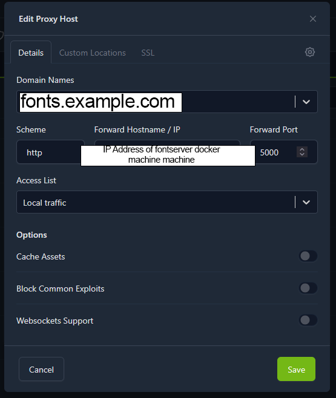
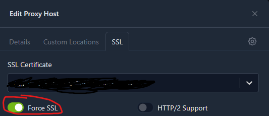

Important: This is an HTTP-only fork of the CollaboraOnline/fontserver designed to work behind a reverse proxy. Read the setup instructions carefully because deployment has changed.

# HTTP Simple Fontserver for Collabora Online

This is a simple Flask-based application that serves font files for Collabora Online's [remote font configuration](https://sdk.collaboraonline.com/docs/installation/Configuration.html#enable-download-and-availability-of-more-fonts-by-pointing-to-a-font-configuration-file) feature. It is intended to run this application as a docker container. The app generates a `fonts.json` and the webserver serves it. This file contains metadata about the available fonts, including the font file URIs and MD5 hashes.

**Note:** This application is not for production, only for development and testing.
## Prerequisites
- Docker
- Reverse proxy (handles HTTPS and certificate management)
- Domain/subdomain for the reverse proxy (even Duckdns works)
## Build and Run:
### Step 0: Clone this repository
Run on the machine that will be running fontserver:

`git clone https://github.com/ognotjw/fontserver-http.git`

### Step 1: Copy font files to `fonts/` subdirectory.
Place your font files in the fonts/ subdirectory:
- Supported formats: TrueType and OpenType
- Do not use subdirectories—place all fonts directly in fonts/
- File names and extensions are case-insensitive (both TTF and ttf work)

### Step 2: Build the Docker image
```bash
sudo docker build -t fontserver .
```
### Step 3: Set up your reverse proxy
Point your reverse proxy (e.g., fonts.example.com) to the fontserver host's IP address on port 5000. Enable HTTPS with an SSL certificate. Collabora requires it.

Example with Nginx Proxy Manager:
 

### Step 4: Run the Docker container
**IMPORTANT:** Replace `https://fonts.example.com` with your actual reverse proxy domain in the `-e SERVER_BASE_URL` environment variable. The default value is `https://127.0.0.1:5000`.

To run the container and mount your `fonts/` directory, use the following command:
```bash
sudo docker run -d --name fontserver -p 5000:5000 -e SERVER_BASE_URL=https://fonts.example.com -v $(pwd)/fonts:/app/fonts fontserver
```

This will:
- Start the Flask application on port 5000.
- Mount the `fonts/` directory from your host to `/app/fonts` in the container.

Do not remove the `fonts/` directory after deployment.


### Step 5: Set up Collabora to use this fontserver
#### Option A: Environment Variable (Recommended)
- Pass this setting in the command line, for example when you start a `collabora/code` container, in the `extra_params` environment variable add:

```
--o:remote_font_config.url=https://fonts.example.com/fonts.json
```
Where the url is the one from the reverse proxy.

#### Option B: Configuration File
- In `/etc/coolwsd/coolwsd.xml` set the `<remote_font_config>`, for example:

```xml
<remote_font_config>
    <url desc="URL of optional JSON file that lists fonts to be included in Online" type="string" default="">https://fonts.example.com/fonts.json</url>
</remote_font_config>
```
Note: using the environment variable is easier because the `coolwsd.xml` configuration requires you to mount /etc/coolwsd on the container

---

## License
This Source Code Form is subject to the terms of the Mozilla Public License, v. 2.0. If a copy of the MPL was not distributed with this file, You can obtain one at [http://mozilla.org/MPL/2.0/](http://mozilla.org/MPL/2.0/).
